# Logigrammes WaveControl (Mermaid)

Ce document regroupe tous les logigrammes du projet en syntaxe Mermaid `flowchart`, pour une utilisation directe dans les outils compatibles Mermaid.

Pour améliorer la lisibilité visuelle, chaque logigramme utilise :
- un espacement augmenté entre les nœuds,
- une palette cohérente (début/fin, action, décision, résultat),
- une structuration des branches qui évite les libellés collés.

---

## 0) Navigation haut niveau de l'application

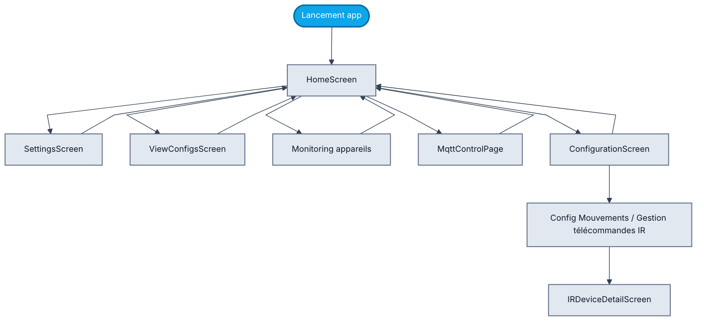

---

## 1) Navigation globale et lancement

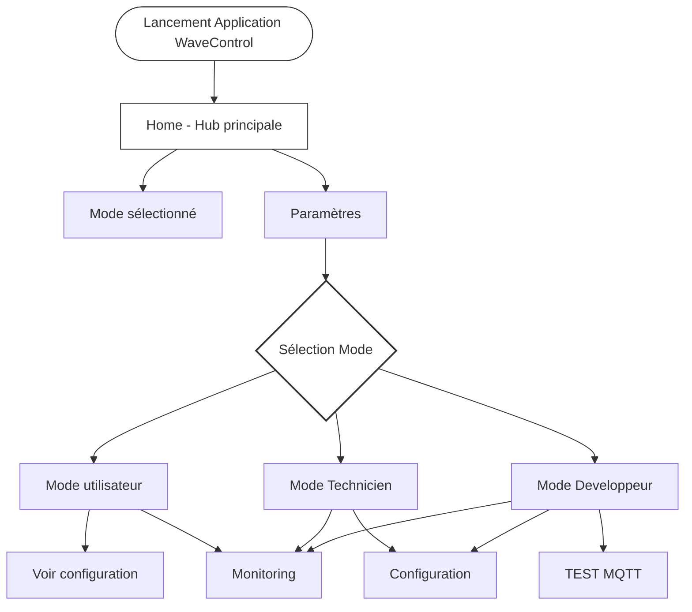

---

## 2) Commande MQTT complète

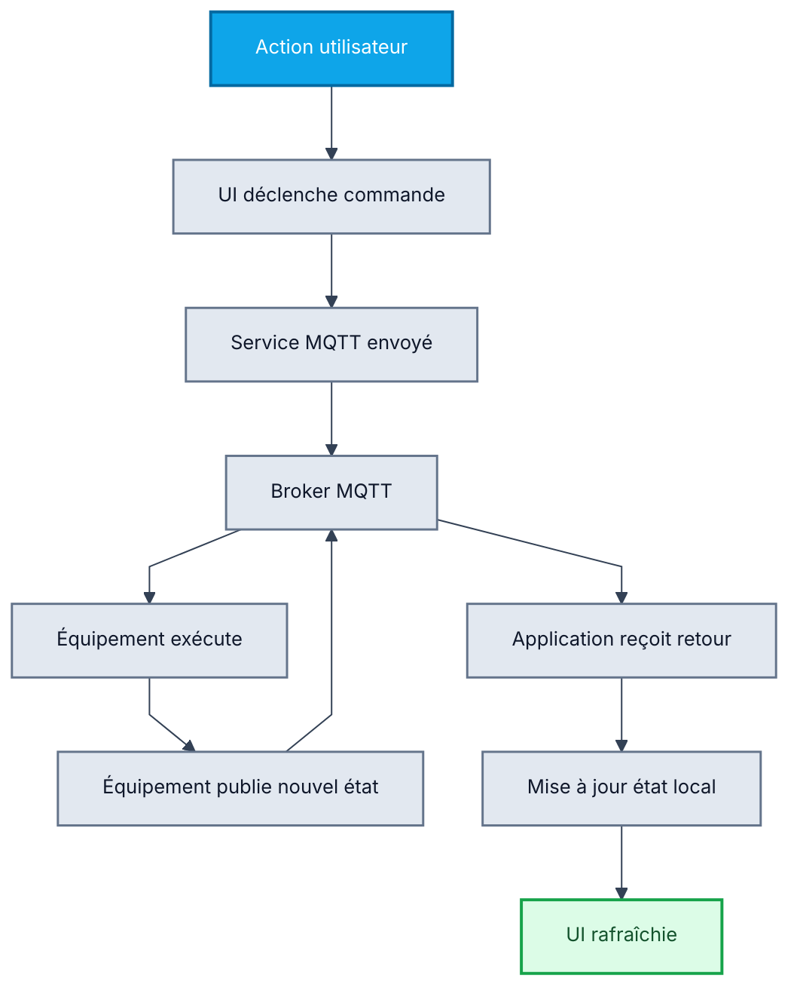

---

## 3) Reconnexion réseau

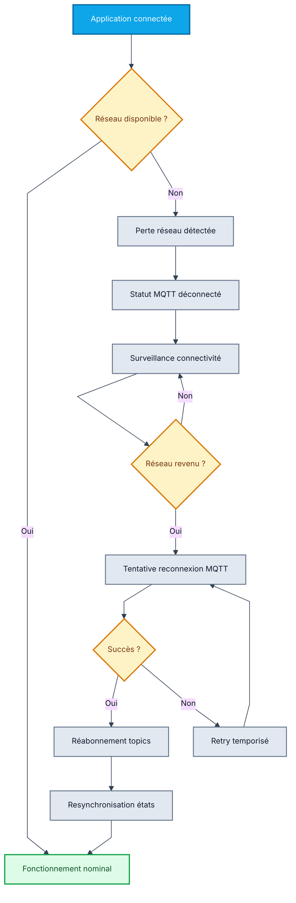

---

## 5) Workflow configuration bracelet

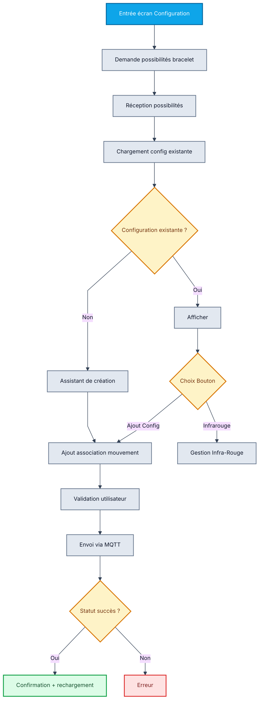

---

## 6) Gestion des périphériques IR

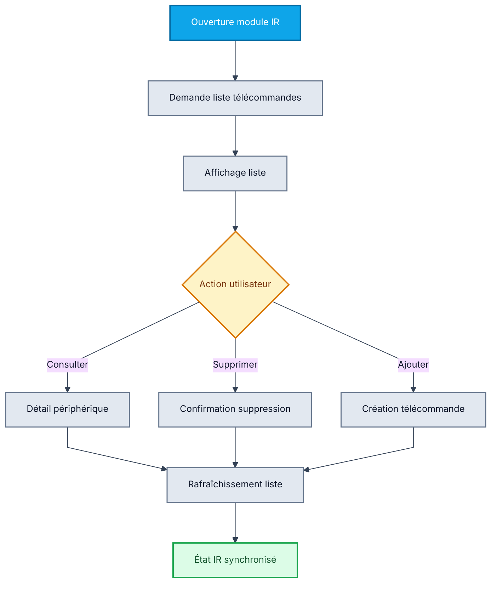

---

## 7) Traitement d'un message entrant

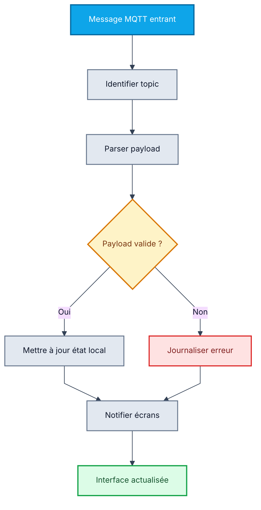

---

## 8) Workflow ajout d'action dans une télécommande IR

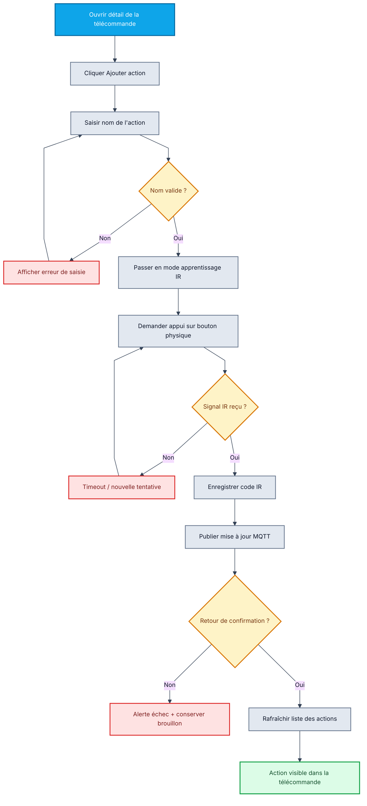

---
## 9) Workflow menu Paramètres

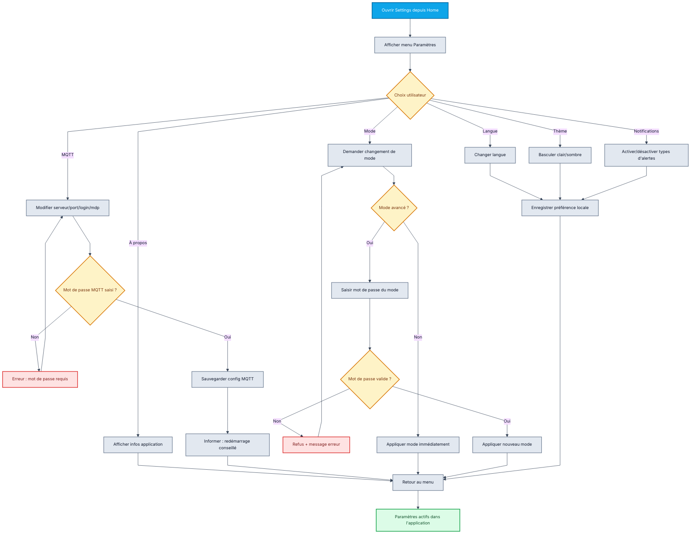
## 10) Workflow Monitoring

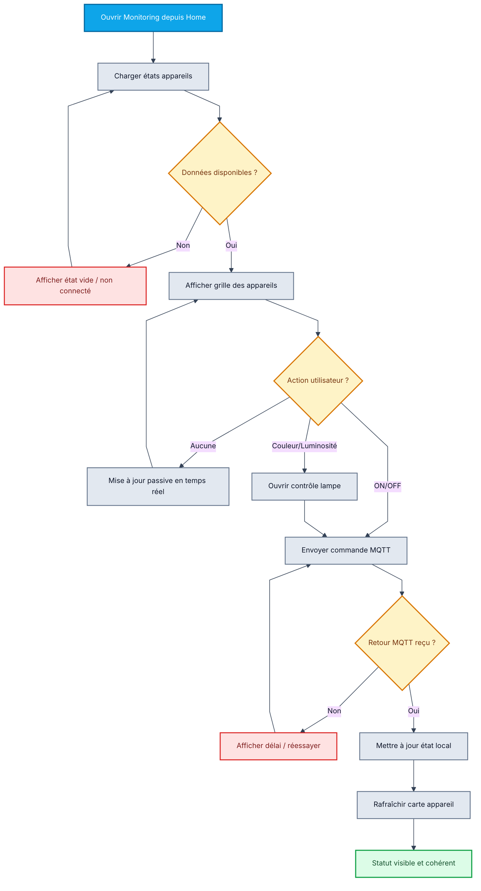

---

## 11) Workflow TEST.MQTT

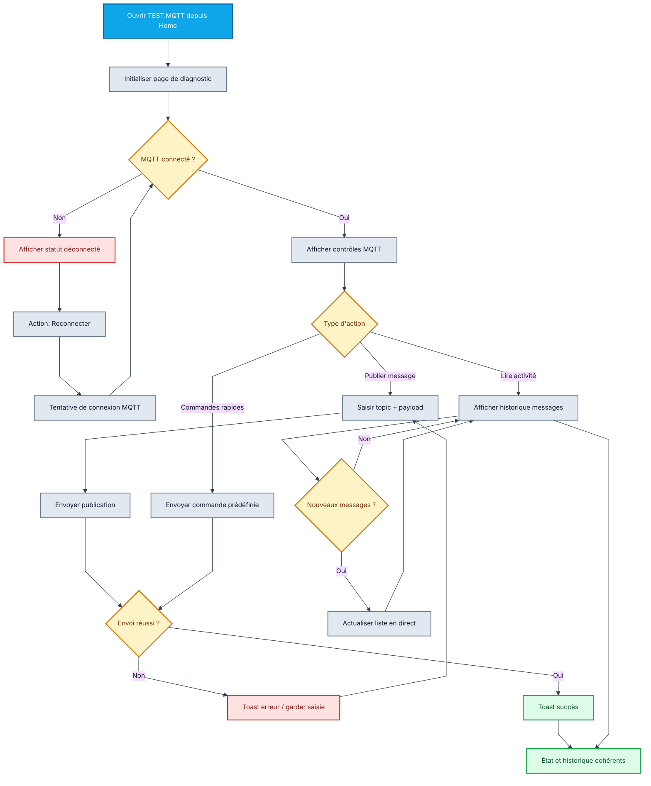

---